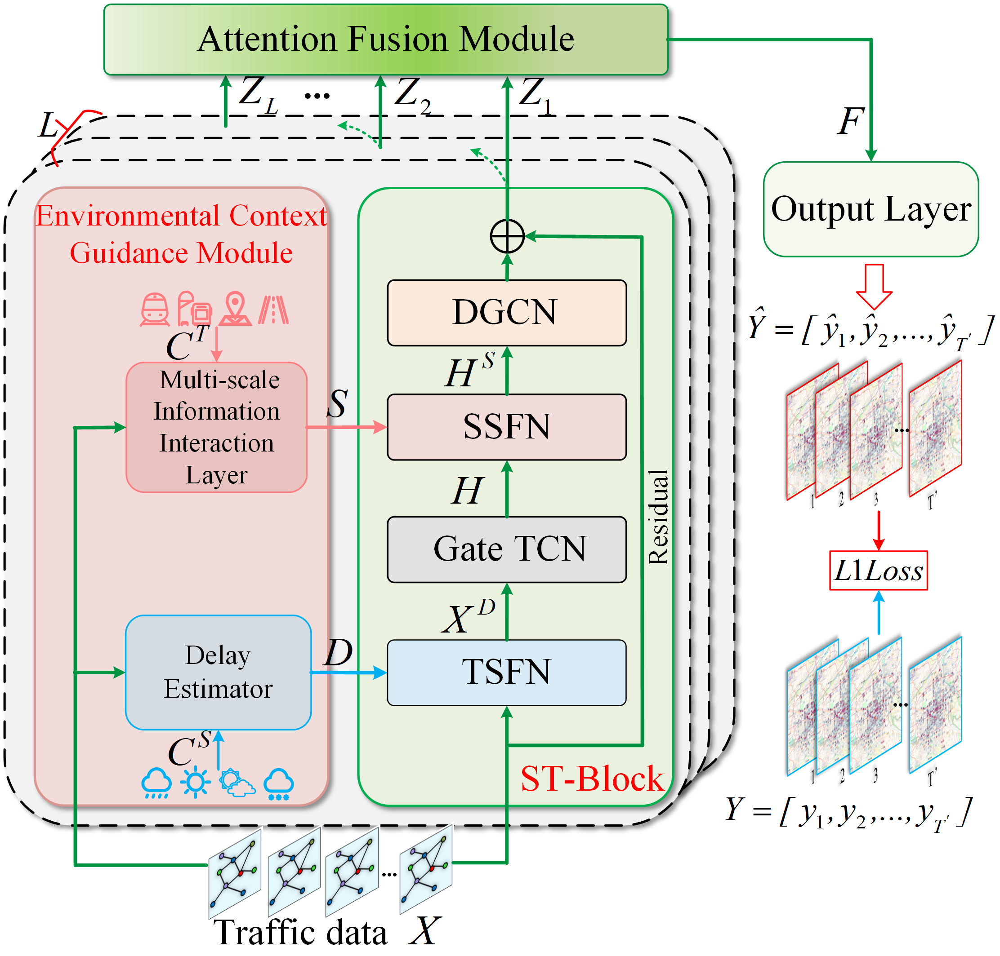

# EGSTN-main

## 1. Title

### Traffic Prediction with Environmental Context-Guided Spatiotemporal Network

## 2. Framework


## 3. Requirements

## 4. Train Commands

```
python train.py --force True --city ShenZhen_City --model EGSTN
```


