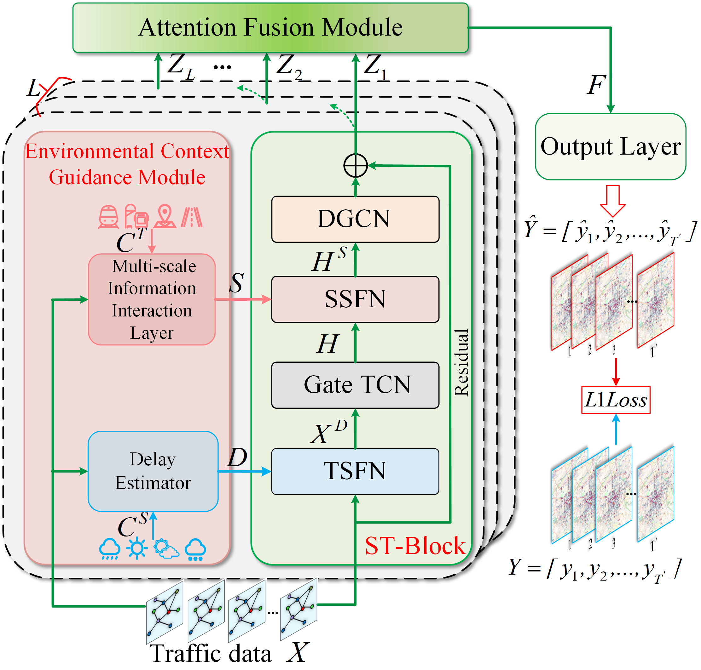

# EGSTN-main

## 1. Title

### A Mobile Traffic Prediction Method with Environmental Anomaly Awareness and Multi-Level Context Learning

## 2. Framework


## 3. Requirements

Python >= 3.8
torch = 1.13.0
numpy = 1.25.2

## 4. Train Commands

```
python train.py --force True --city ShenZhen_City --model EGSTN
```
## 5. File directory description
eg:

```
filetree 
├── /data/ 
├── /garage/
├── README.md
├── EGSTN.py
├── train.py
├── utils.py
├── util.py
```

## dataset

Download the data from https://drive.google.com/file/d/16xbiRvh5jJx2A4Swv9dEMEz_Y0AEoQTM/view?usp=sharing


